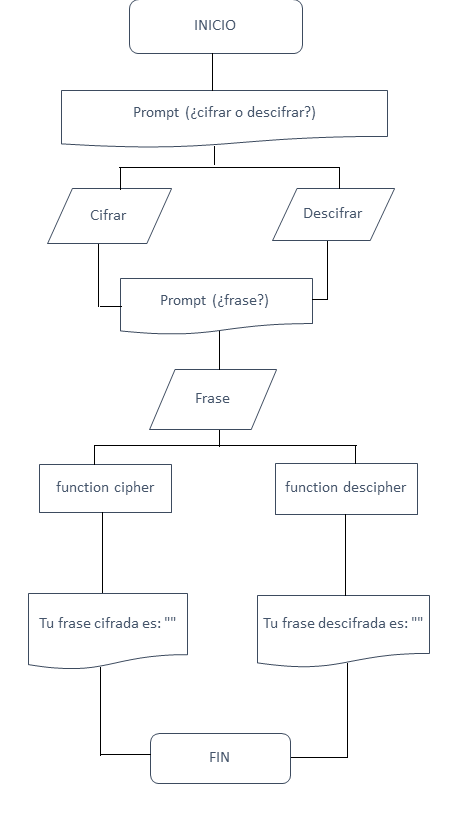

# Cifrado Cesar

### Objetivo
Crear un algoritmo que pueda cifrar y descifrar una cadena de texto

### Descripción
Este algorritmo consiste de 3 funciones. El primero determina si se utilizará la función cipher o decipher a través de un prompt, en el cual le pedimos al usuario que escoja entre dos opciones 1 y 2, cipher y descipher respectivamente.

La segunda función (cipher) cifra la frase ingresada que hemos obtenido a través de un prompt. Utilizamos el bucle do while para asegurarnos que siempre que no se cumpla la condición while (la frase ingresada no sea ni mayúscula ni miníscula), se devuelva el prompt pidiendo un texto válido. Luego, dentro tenemos un for que nos servirá para recorrer la frase ingresada. A su vez, dentro del for tenemos condiciones if que nos sirven para cifrar el texto dependiendo de si la frase ingresada está en minúsculas o mayúsculas, o caso contrario, devuelve un alert pidiendo al usuario que ingrese una frase válida.

La tercera función (descipher) sigue los mismos pasos que la primera, con la diferencia que descifra la frase en lugar de cifrarla.

### Flujo del Programa

### Herramientas Utilizadas
* HTML5
* CSS3
* Javascript (ES6)